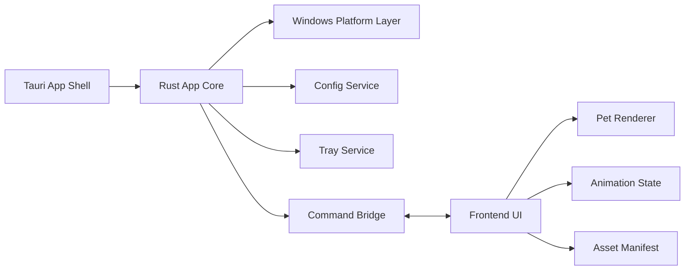

# PicoPet Windows MVP 设计文档

## 1. 背景

PicoPet 是一个类似 Codex pet 的桌面宠物软件。第一版目标不是做完整宠物平台，而是做一个轻量、稳定、可常驻运行的 Windows 桌宠 MVP，为后续跨平台、皮肤包、互动能力保留清晰边界。

当前仓库是新项目，暂无既有代码和提交历史。因此本设计按从零启动的新项目规划。

## 2. 目标

- 做一个 Windows-only 桌宠 MVP。
- 使用 Tauri 2 + Rust + WebView2。
- 常驻内存目标为 50-100 MB。
- 支持透明无边框窗口、始终置顶、拖拽移动、托盘菜单、退出、暂停/继续动画、点击穿透开关。
- 使用内置 spritesheet/atlas 动画资源。
- 保存并恢复窗口位置、缩放比例、点击穿透状态和动画暂停状态。
- 保留平台边界，未来可扩展 macOS/Linux，但第一版不实现跨平台。

## 3. 非目标

- 第一版不支持 macOS/Linux。
- 第一版不支持 AI 聊天、主动对话、日程提醒或大模型集成。
- 第一版不支持外部皮肤包、资源导入器、皮肤编辑器或插件系统。
- 第一版不支持复杂行为树、物理模拟、路径寻路或多宠物同屏。
- 第一版不追求低于 50 MB 的极限内存占用。

## 4. 技术路线

推荐路线为 Tauri 2 + Rust + WebView2：

- Rust 侧负责系统能力：窗口控制、点击穿透、托盘、配置读写、应用生命周期。
- 前端侧负责展示能力：桌宠动画、拖拽交互入口、暂停状态提示、资源 fallback。
- WebView2 使用系统运行时，避免像 Electron 一样随应用打包完整 Chromium。
- Tauri 项目结构天然适合把系统能力放在 Rust 层，把渲染和交互放在前端层。

Windows 发行包需要明确 WebView2 Runtime 策略：安装器应检测目标机器是否具备可用的 WebView2 Runtime；缺失时给出安装引导或使用 Tauri 推荐的 Windows 打包方案处理运行时依赖。

参考文档：

- Tauri: <https://tauri.app/start/>
- Tauri Window Customization: <https://tauri.app/learn/window-customization/>
- Tauri System Tray: <https://tauri.app/learn/system-tray/>
- Electron Docs: <https://www.electronjs.org/docs/latest/>

## 5. 推荐方案

采用“极简 Windows MVP + 轻量平台边界”方案。

功能范围按极简 MVP 收敛，只实现桌宠常驻运行所需的核心能力。代码结构上保留平台边界，但不为未来平台做过度抽象。第一版应优先证明以下事情：

- Windows 透明桌宠窗口可以稳定置顶运行。
- 用户可以拖动桌宠，不会丢失位置。
- 托盘菜单可以可靠控制常用行为。
- 点击穿透可以开关，并能保存状态。
- 内置动画可以低资源循环播放。
- 配置损坏或资源加载失败时，应用仍能启动。

## 6. 用户体验

### 6.1 启动

应用启动后显示一个透明无边框小窗口，窗口内只有桌宠角色。窗口默认始终置顶，不显示系统标题栏，不在主界面显示复杂控制区。

### 6.2 拖拽

默认状态下用户可以拖拽桌宠移动位置。拖拽结束后保存窗口位置。下一次启动时恢复到上次位置。

### 6.3 点击穿透

默认不启用点击穿透，保证用户可以直接拖拽和操作桌宠。用户可以通过托盘菜单切换点击穿透：

- 点击穿透关闭：桌宠可拖拽，可响应基础交互。
- 点击穿透开启：鼠标事件穿过桌宠窗口，桌宠更像桌面装饰。

切换状态后立即保存配置。

### 6.4 托盘菜单

托盘菜单提供第一版所有非视觉控制能力：

- 暂停动画 / 继续动画
- 开启点击穿透 / 关闭点击穿透
- 重置位置
- 退出

托盘菜单文案使用中文。

### 6.5 暂停动画

暂停动画后，桌宠保持当前帧或 fallback 静态帧，不继续播放动画。继续动画后恢复循环播放。

## 7. 架构



### 7.1 Rust App Core

Rust App Core 是系统能力入口，负责注册 Tauri 命令、初始化窗口、初始化托盘、加载配置、把平台操作封装成可测试的服务。

### 7.2 Windows Platform Layer

Windows Platform Layer 负责 Windows 特有能力：

- 设置透明窗口和无边框行为。
- 设置始终置顶。
- 设置点击穿透。
- 读取和更新窗口位置。

第一版只实现 Windows，接口命名仍使用 `platform/windows` 边界，避免系统调用散落在应用核心逻辑中。

### 7.3 Config Service

Config Service 负责本地 JSON 配置：

- 启动时读取配置。
- 缺失字段使用默认值。
- 配置损坏时回退默认值并覆盖修复。
- 状态变化时写回配置。

### 7.4 Tray Service

Tray Service 负责系统托盘图标和菜单。菜单动作通过 Rust Core 更新状态，并把必要状态同步给前端。

### 7.5 Frontend UI

Frontend UI 不承担系统能力，只做桌宠展示和基础交互。它通过 Tauri command 与 Rust 层通信。

### 7.6 Pet Renderer

Pet Renderer 负责 spritesheet/atlas 帧动画播放。第一版只支持内置资源，不读取外部皮肤包。

## 8. 配置格式

配置文件使用 JSON，第一版字段如下：

```json
{
  "window": {
    "x": 1200,
    "y": 680,
    "scale": 1.0,
    "always_on_top": true,
    "click_through": false
  },
  "animation": {
    "paused": false,
    "idle_fps": 12,
    "interactive_fps": 30
  }
}
```

字段约束：

- `window.x` 和 `window.y` 是窗口左上角屏幕坐标。
- `window.scale` 第一版允许范围为 0.5-2.0。
- `window.always_on_top` 第一版固定为 `true`，配置字段保留但不暴露菜单开关。
- `window.click_through` 默认 `false`。
- `animation.paused` 默认 `false`。
- `animation.idle_fps` 默认 `12`。
- `animation.interactive_fps` 默认 `30`。

## 9. 动画资源

第一版使用内置 spritesheet/atlas，随应用打包。

资源结构建议：

```text
src/assets/pet/
  pico_idle.png
  pico_idle.json
```

atlas manifest 示例：

```json
{
  "image": "pico_idle.png",
  "frame_width": 128,
  "frame_height": 128,
  "frames": 8,
  "fps": 12,
  "loop": true
}
```

第一版只要求 `idle` 动画。拖拽中可以继续播放 idle，不单独要求 dragging 动画。

## 10. 资源占用策略

- 空闲动画默认 12 FPS。
- 交互时最多提升到 30 FPS。
- 页面不可见或动画暂停时停止 requestAnimationFrame 循环。
- 图片资源一次加载后复用，不重复创建 Image 对象。
- 前端不引入大型 UI 框架，优先使用原生 Canvas、少量 TypeScript 和最小 CSS。
- Rust 层避免后台轮询，状态变化由事件驱动。

## 11. 错误处理

- 配置文件不存在：创建默认配置。
- 配置文件损坏：使用默认配置启动，并覆盖写入修复后的配置。
- 托盘初始化失败：主窗口仍启动，记录错误。
- 点击穿透设置失败：保持原状态，配置不写入失败状态。
- 动画资源加载失败：显示内置 fallback 静态帧。
- 窗口位置超出当前屏幕：启动时重置到主屏幕右下角附近。

## 12. 测试策略

### 12.1 Rust 单元测试

覆盖内容：

- 默认配置生成。
- 配置缺失字段补全。
- 配置损坏时回退默认值。
- `scale` 范围裁剪。
- 窗口位置超出屏幕时重置。
- 点击穿透状态切换失败时不污染配置。

### 12.2 前端单元测试

覆盖内容：

- atlas manifest 解析。
- 当前帧计算。
- 暂停后帧索引不继续推进。
- FPS 切换逻辑。
- 资源加载失败时进入 fallback 状态。

### 12.3 Windows 手动验收

验收内容：

- 应用启动后窗口透明无边框。
- 桌宠显示在其他窗口上方。
- 可以拖拽桌宠并在重启后恢复位置。
- 托盘菜单可以暂停/继续动画。
- 托盘菜单可以切换点击穿透。
- 点击穿透开启后鼠标可以穿过桌宠窗口。
- 点击穿透关闭后可以再次拖拽桌宠。
- 托盘退出可以完全关闭进程。
- 常驻内存保持在 50-100 MB 目标范围内。

## 13. 里程碑

### 里程碑 1：项目脚手架和基础窗口

建立 Tauri 2 项目结构，启动透明无边框窗口，显示基础前端页面。

### 里程碑 2：内置桌宠动画

加入 spritesheet/atlas 资源，完成 idle 动画循环播放和 fallback 静态帧。

### 里程碑 3：拖拽与配置持久化

完成窗口拖拽、位置保存、启动恢复、配置损坏修复。

### 里程碑 4：托盘菜单

完成托盘图标、暂停/继续动画、重置位置、退出。

### 里程碑 5：点击穿透

完成 Windows 点击穿透开关，状态同步到托盘和配置。

### 里程碑 6：资源占用和验收

完成低 FPS 策略、无后台轮询检查、Windows 手动验收和内存记录。

## 14. 后续扩展边界

后续版本可以按独立 spec 追加：

- macOS/Linux 平台层。
- 外部皮肤包和资源校验。
- 多状态动画。
- 轻量互动动作。
- 开机启动。
- 多显示器高级处理。
- AI 对话或本地提醒。

这些能力不进入第一版 MVP，以免影响轻量性和落地速度。
