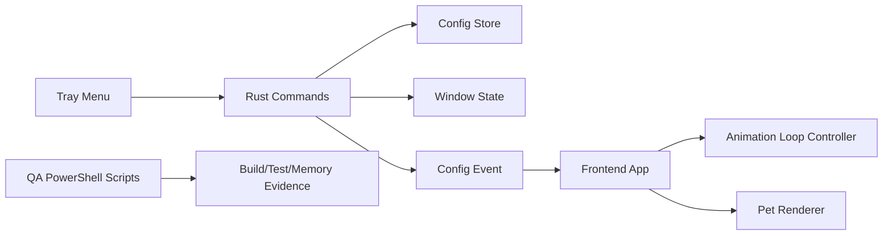

# PicoPet Windows Alpha 稳定化设计文档

## 1. 背景

PicoPet 已完成 Windows MVP：Tauri 2 + Rust + WebView2 的透明无边框桌宠窗口、内置 spritesheet 动画、拖拽持久化、托盘菜单、暂停/继续、重置位置、退出和点击穿透均已落地。当前阶段的重点不是扩大功能面，而是把 MVP 打磨成可以交给用户试用的 Windows Alpha。

Alpha 阶段继续坚持轻量目标：不引入 Electron，不引入 React/Vue/Svelte/Tailwind，不加入 AI 对话、插件系统或跨平台实现。所有改动都围绕稳定性、可验证性和最小体验补强展开。

## 2. 目标

- 保持 Windows-only，不实现 macOS/Linux。
- 维持 Tauri 2 + Rust + WebView2 + Vanilla TypeScript 架构。
- 让暂停动画或页面隐藏时停止 `requestAnimationFrame` 循环，降低后台 CPU 占用。
- 暴露已有 `window.scale` 能力，在托盘提供放大、缩小、重置大小。
- 将 Windows 内存基线和 release/debug 打包检查脚本化，减少手工步骤。
- 增加 README、Windows Alpha QA 清单和发布流程文档，让项目能被稳定复现。
- 继续以 release build 下 host + WebView2 子进程 Private Working Set 50-100 MB 作为内存目标。

## 3. 非目标

- 不做跨平台窗口层。
- 不接入 OpenAI API、本地大模型或聊天功能。
- 不做外部皮肤包、资源导入器、皮肤编辑器或插件系统。
- 不做复杂行为树、物理模拟、路径寻路或多宠物同屏。
- 不更换前端技术栈，不引入大型 UI 框架。
- 不追求低于 50 MB 的极限内存优化。

## 4. 方案比较

### 方案 A：QA 优先稳定化

先补脚本、文档和验收流程，再做小范围代码修正。优点是发布风险最低，缺点是用户可感知体验提升有限。

### 方案 B：体验优先增强

先做托盘缩放、点击反馈、资源美化等体验项。优点是可见变化明显，缺点是容易在 Alpha 阶段扩大范围。

### 方案 C：平台扩展

开始抽象 macOS/Linux 平台层。优点是更接近长期目标，缺点是会分散 Windows MVP 稳定化资源，并推高测试成本。

推荐采用方案 A + 小范围方案 B：先把性能、QA、文档做稳，同时只加入一个已经有配置字段支撑的体验项，即托盘缩放。暂不进入方案 C。

## 5. 功能设计

### 5.1 动画空闲策略

当前前端在图片加载后会持续调度 `requestAnimationFrame`，即使动画暂停时也会继续进入 tick。Alpha 阶段改为显式动画循环控制器：

- 图片未加载时不启动循环。
- `animation.paused = true` 时取消已排队的动画帧。
- `document.hidden = true` 时取消已排队的动画帧。
- 从暂停恢复或页面重新可见时重新启动循环。
- fallback 静态帧不启动循环。

该逻辑放入 `src/pet/animationLoop.ts`，以纯 TypeScript 单元测试覆盖，不把调度细节继续散落在 `src/app.ts`。

### 5.2 托盘缩放

配置中已有 `window.scale`，MVP 只保存和应用它，没有用户入口。Alpha 阶段在托盘加入三个菜单项：

- `放大`
- `缩小`
- `重置大小`

缩放范围保持 0.5-2.0，步进为 0.25。缩放后立即：

- 更新配置并持久化。
- 调整 Tauri 窗口物理尺寸。
- 保持窗口在主屏幕可见范围内。
- 通过现有 `picopet://config` 事件同步前端。
- 更新 canvas CSS 尺寸。

点击穿透、暂停状态和窗口位置不因缩放丢失。

### 5.3 Windows QA 自动化

保留现有 Markdown 记录，同时增加 PowerShell 脚本：

- `scripts/windows-release-smoke.ps1`：设置 UTF-8 输出，补齐 Corepack shim PATH，运行 `pnpm check` 和 `pnpm tauri build --debug`，可选运行 release build。
- `scripts/windows-memory-baseline.ps1`：读取 PicoPet 进程树，区分 Host、WebView2、LaunchShell，输出进程表和汇总对象，支持写入 JSON 记录。

脚本不要求管理员权限，不修改系统配置，不自动杀进程。进程清理由使用者或后续专门脚本处理。

### 5.4 README 和发布文档

新增根目录 README，说明：

- 项目定位。
- 当前 Windows-only 状态。
- 环境要求。
- 本地开发命令。
- 测试和打包命令。
- 内存目标和测量方式。
- 当前非目标。

新增 `docs/qa/windows-alpha-checklist.md` 和 `docs/release/windows-release-process.md`，分别记录 Alpha 手动验收和 Windows 发布流程。

## 6. 架构边界

Rust 侧继续负责系统能力：窗口尺寸、位置、托盘事件、配置持久化。前端继续只负责渲染和前端事件同步。QA 脚本不进入运行时代码路径。

## 7. 测试策略

- TypeScript 单元测试覆盖动画循环启动、暂停、隐藏、恢复和 canvas 缩放同步。
- Rust 单元测试覆盖缩放步进、范围裁剪、窗口尺寸派生和托盘菜单 helper。
- `pnpm check` 继续作为基础门禁。
- `pnpm tauri build --debug` 继续作为 Windows debug bundle 门禁。
- release 内存记录使用 `scripts/windows-memory-baseline.ps1` 生成证据，再手动写入 `docs/qa/memory-baseline.md`。

## 8. 验收标准

- `pnpm check` 通过。
- `pnpm tauri build --debug` 通过。
- 托盘菜单包含暂停/继续、点击穿透、重置位置、放大、缩小、重置大小、退出。
- 暂停动画后不再排队新的 animation frame；恢复后动画继续。
- 页面隐藏后不再排队新的 animation frame；重新可见后动画继续。
- 缩放保持在 0.5-2.0，且窗口不被放到屏幕外。
- README 能指导新开发者在 Windows 上安装、测试和打包。
- QA 脚本能在不要求管理员权限的情况下输出可记录的验证结果。

## 9. 后续边界

Alpha 稳定化完成后，再考虑以下独立 spec：

- 桌宠视觉资源替换和多动画状态。
- 开机启动。
- 多显示器高级位置策略。
- macOS/Linux 平台层。
- AI 对话或本地提醒。
